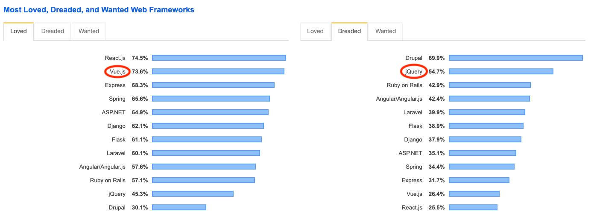

# Vue.js 란?
- 2014 년 11월 9일에 Vue.js v0.11 Release 후 현재 v2.6.10 까지 Release 됨
- Google Creative Lab에서 일하던 [EVAN YOU](https://blog.evanyou.me/) 가 개발 
- 현재 가장 주목받고 있는 Frontend Framework 중 하나
  

  <sup>이미지 출처 : 
  [risingstars.js.org](https://risingstars.js.org/2018/en/)
  </sup>

<div class="page" />

## Developer Survey Results 2019
> **React.js and Vue.js are both the most loved and most wanted web frameworks by developers, while Drupal and jQuery are most dreaded.**




<sup>이미지 출처 : 
[stackoverflow-Developer Survey Results 2019](https://insights.stackoverflow.com/survey/2019#technology-_-most-loved-dreaded-and-wanted-web-frameworks)
</sup>

<div class="page" />

# Vue.js 의 장점
## 가볍고 유연함
- **ViewModel layer에 초점을 맞추어 핵심 라이브러리가 개발됨**  
  - Lean & Small (**16KB** minified and gzipped)
  - 실제 개발 시에는 Vue.js 관련 라이브러리 사용이 필수

- **전체 아키텍처를 새롭게 구성할 필요가 없음**  
  - 기존 앱의 일부 화면에 적용해본 후 전체 적용을 검토해볼 수 있음

- **SPA(Single Page Application)으로 구성 가능**
  - Dynamic UI 의 웹 페이지를 만들 때 유리
  - Router 기능 지원

## 진입 장벽이 상대적으로 낮음
- `<script>` 태그를 활용하여 CDN 주소를 추가한 후 vue.js 디렉티브 몇 가지를 익히면 바로 프로그래밍 가능
- 문서가 매우 잘 정리되어 있고, 한글 번역도 매우 훌륭함
- ~~개떡~~같이 만들어도 동작은 잘 하는편 (React같이 엄격하지 않음, Magic이 있음)

<div class="page" />

# Vue.js 주요컨셉
## Inspired by MVVM Pattern 
- View
  - HTML + CSS
- ViewModel 
  - View를 위한 모델
  - View의 실제 논리 및 데이터 흐름 담당

- MVVM Pattern을 사용하는 이유  
애플리케이션의 로직(ViewModel)과 사용자 UI(View)를 분리


<div class="page" />

## Single File Component
- 하나의 `.vue`파일에서 HTML/CSS/JavaScript를 모두 기술하게 함
  ```js
  <!-- my-component.vue -->
  <template>
    <div>이 곳은 사전에 컴파일 됨</div>
  </template>
  <script src="./my-component.js"></script>
  <style src="./my-component.css"></style>
  ```
- **관심사의 분리**
  - 타입별 파일 분리하는 것이 아니라 느슨하게 결함 된 컴포넌트로 나누어 구성
  - Single File Component 컨셉을 지키게 되면 컴포넌트의 응집력과 유지 보수성이 좋아짐

> 현대적인 UI 개발에서 코드베이스를 서로 얽혀있는 세 개의 거대한 레이어로 나누는 대신, 느슨하게 결합 된 컴포넌트로 나누고 구성하는 것이 더 중요 

<div class="page" />

## Virtual DOM
**효율적인 DOM 조작을 위해 사용**

### 브라우저의 Workflow


<sup>이미지 출처 : 
[ReactJS의 Virtual DOM과 Repaint, Reflow](http://blog.drakejin.me/React-VirtualDOM-And-Repaint-Reflow/)
</sup>
- 브라우저가 전달받은 HTML을 파싱하여 DOM 트리를 만듬 (HTML Element 👉 DOM Node)
- CSS 파일과 inline style 파싱
- Attachment : 각 DOM 노드들의 스타일 처리하는 과정  
(DOM Tree + Style Rules = Render Tree)
- Layout : 각 노드들의 스크린의 좌표가 주어짐
- Painting : 렌더링 된 요소들에 색을 입히는 과정

😫**동적인 UI를 만들 경우 DOM과 CSS 조작이 매우 빈번하게 일어나게 되고 Reflow(Layout)와 Repaint 작업이 계속 일어나게 되고, 이런 작업들은 리소스를 상대적으로 많이 차지하는 연산임**
> 예를 들어 30개의 노드를 하나 하나 수정하면, 그 뜻은 30번의 (잠재적인) 레이아웃 재계산과 30번의 (잠재적인) 리렌더링을 초래한다는 뜻

<div class="page" />

😎**이런 비효율을 개선하기 위해 Virtual DOM이 등장**  


<sup>이미지 출처: 
[Virtual Dom](https://medium.com/naukri-engineering/naukriengineering-virtual-dom-fa8019c626b)</sup>

- Virtual DOM은 실제 브라우저에 렌더링 하지 않고 메모리 상에만 존재하는 개념이므로 연산 비용이 매우 적음
- Real DOM 대신 DOM 트리의 변화를 체크하고 모든 변화를 하나로 묶어서 던져주면 연산의 횟수를 줄일 수 있음
  (~~연산의 규모는 커질 수 있지만~~)

<div class="page" />

# 개발환경 설정
## Node.js 설치
- [Node.js 공식 홈페이지](https://nodejs.org/ko/)에서 LTS 버전 다운로드 및 설치
  
- node 설치 확인
  ```bash
  $> node -v
  v10.16.3
  ```
- npm 최신버전 업그레이드 및 확인
  ```bash
  $> npm install -g npm
  $> npm -v
  6.9.0
  ```
> Mac OS 사용시 명령어 앞에 `sudo`를 꼭 붙여야 함. 안 붙이면 permission denied 에러 발생 ㄷㄷㄷ

## Visual Studio Code 설치
- [Visual Studio Code 공식 홈페이지](https://code.visualstudio.com/)에서 다운로드 및 설치
- Vue.js 개발 관련 플러그인  
  

## Vue.js devtools 설치
- 크롬 브라우저에서 웹스토어 검색 또는 아래 사이트로 이동
  https://chrome.google.com/webstore/category/extensions
- `Vue.js devtools` 검색 후 `Chrome에 추가` 버튼 클릭
  
- url 입력 창 옆에 아이콘 추가됐는지 확인
- [chrome://extensions/](chrome://extensions/) 에서 Vue.js devtools 세부정보 중 `확장 파일 URL에 대한 액세스 허용` 설정

## Vue-cli 설치
- 커맨드 라인 인터페이스 기반의 스캐폴딩 도구 
- 설치 및 확인
  ```bash
  ## yarn 패키지 매니저도 같이 설치
  $> npm install -g yarn @vue/cli 
  $> vue -V
  3.9.3
  ```

<div class="page" />

# 첫번째 Vue.js Application 
> 아주 간단한 Application 이기 때문에 [CodePen](https://codepen.io/pen/)에서 실습
- html
  ```html
  <!DOCTYPE html>
  <html>
  <head>
    <meta charset="utf-8">
    <title>Hello Vue.js</title>
    <script src="https://unpkg.com/vue/dist/vue.js"></script>
  </head>
  <body>
    <div id="app">
      <h2>{{message}}</h2>
    </div>
  </body>
  </html>
  ```
- javascript
  ```javascript
  var model = {
    message : 'Hello Vue.js'
  };
  var app = new Vue({
    el : '#app',
    data : model
  })
  ```
- 모두 입력 후 `Ctrl` + `Enter` 

# 첫번째 Vue.js Application 분석
- Vue 객체 생성 시 지정된 옵션에 의해 **HTML요소**와 **데이터** 참조
- 선언적으로 HTML DOM에 데이터를 렌더링 하기 위해 콧수염 표현식 사용
  

