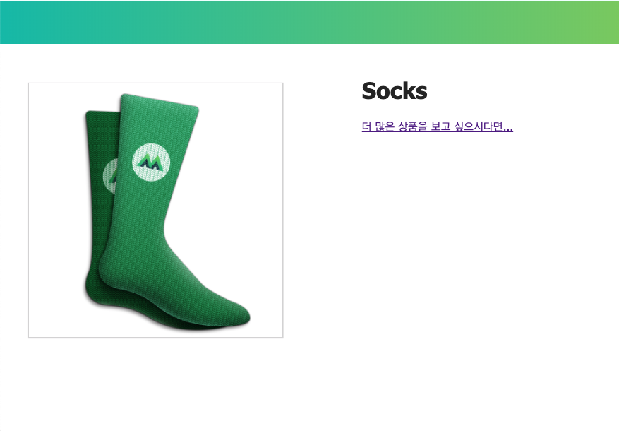
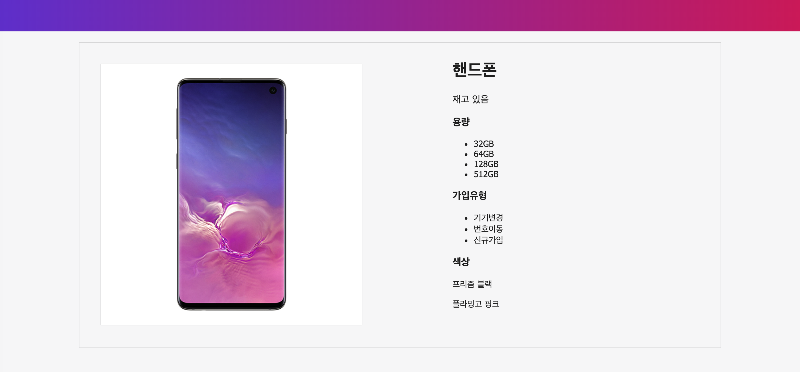
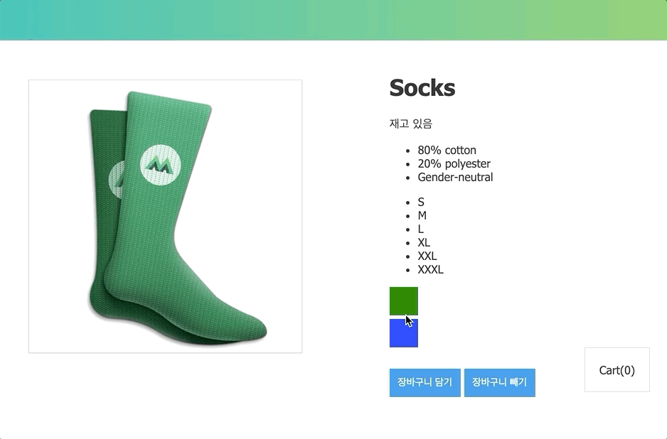
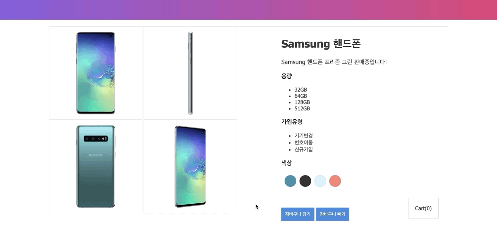

# 🚀사전 준비
## 쇼핑몰 예제 코드 작성 (**Step_0**)


### 예제 소스 내려받기
```bash
$> git clone https://github.com/wooyoung85/vuejs-study.git
$> cd vuejs-study/example
## Visual Studio Code 실행
$> code .
```

# 템플릿, 보간법, Mustache 구문, Interpolation (`{{}}`)
- Mustache 구문 안에 있는 값은 해당 data 속성 값으로 대체됨
- data 속성 값이 변경될 때 마다 화면이 갱신됨  
  (아래 예제에서는 `product`나 `onSale` 값이 변경될 때마다 화면이 갱신됨)

  ```html
  <div id="app">
    <p>I have a {{ product }}</p>
    <p>{{ product + 's' }}</p>
    <p>{{ onSale ? 'YES' : 'NO' }}</p>
    <p>{{ product.getSalePrice() }}</p>
  </div>
  ```

# 디렉티브(Directives)
## 선언적 렌더링 (`v-text`, `v-html`)
**HTML Element 콘텐츠 영역 설정**

|Directive|Desc.|
|---|---|
|`v-text`, `{{}}`| innerText 속성에 연결됨|
|`v-html`|innerHtml 속성에 연결됨|

### Expression
```html
<h1>{{ product }}</h1>
<h1 v-text="product"></h1>
```

> `v-html`은 XSS 공격에 취약하기 때문에 사용할 상황을 만들면 안됨

## Attribute 바인딩 (`v-bind`)
**HTML Element 속성들을 바인딩**

### Expression
```html
<!-- 단축 표현법 -->

...
<a v-bind:href="link" target="_blank">More products like this</a>
```

## 조건부 렌더링 (`v-show`, `v-if`, `v-else`, `v-else-if`)
**Vue 객체의 data 속성 값에 따라 렌더링 여부를 결정하는 기능**

|Directive|Desc.|
|---|---|
|`v-if`| 조건에 맞지 않으면 렌더링 안함 |
|`v-show`| 일단 HTML Element를 렌더링 한 후 조건에 맞춰 display 스타일 속성 조정 |  

## 양방향 렌더링 (`v-model`)
다른 디렉티브들은 HTML Element 값을 변경해도 모델 객체의 값이 변경되지 않음  
`input`과 `textarea` 에 `v-model` 디렉티브를 사용하면 양방향 데이터 바인딩을 생성할 수 있음
### Expression
```html
<!-- 입력이 끝난 뒤 화면 변경 -->
<input v-model.lazy="message">
<!-- 항상 type="number" -->
<input v-model.number="message">
<!-- 앞 뒤 공백 제거 -->
<input v-model.trim="message">
```

## 쇼핑몰 예제 코드 작성 (**Step_1**)
[shop_step_1.html](https://github.com/wooyoung85/vuejs-study/blob/master/example/lecture_2/shop_step_1.html) 파일 참고

|단방향 바인딩|양방향 바인딩|
|-|-|
|||

## 반복 렌더링 (`v-for`)
**리스트 같이 반복적인 데이터를 렌더링 할 때 사용**

### Expression
- 배열 데이터
  ```html
  <tr v-for="(contract, index) in contracts">
    <td>{{contract.no}}</td>
    <td>{{contract.name}}</td>
    <td>{{contract.tell}}</td>
    <td>{{contract.address}}</td>
  </tr>
  ```
- 객체 데이터
  ```html
  <option v-for="(val, key, index) in regions v-bind:value="key">
    {{ index+1 }} : {{ val }}
  </option>
  ```

## 쇼핑몰 예제 코드 작성 (**Step_2**)
[shop_step_2.html](https://github.com/wooyoung85/vuejs-study/blob/master/example/lecture_2/shop_step_2.html) 파일 참고



> `v-for` 구문 사용시 `key` Attribute를 부여하면 DOM요소를 추적하는 것이 가능해짐  
> `key` 값은 보통 고유한 값을 부여하게 됨(DB 조회 결과 값 같은 경우에는 Primary Key)  
> 일반적으로 `key` 값을 바인딩하면 좋지만 반드시 빨라진다고 보장할 순 없음

## 이벤트 핸들링 (`v-on`)
**`click`, `keyup`같은 HTML Element에서 발생하는 이벤트 처리**

### Expression
- 인라인 이벤트 핸들링
  ```html
  <button v-on:click="cart += 1">Add to cart</button>

  <!-- 단축 표현법 -->
  <button @click="cart += 1">
  ```
- 이벤트 핸들러 메서드
  ```html
  <button v-on:click="addToCart">Add to cart</button>
  ...

  <script>
  var app = new Vue({
    el: '#app',
    data: model,
    methods: {
      addToCart() {
        this.cart += 1
      }
    }
  })
  </script>
  ```

## 쇼핑몰 예제 코드 작성 (**Step_3**)
[shop_step_3.html](https://github.com/wooyoung85/vuejs-study/blob/master/example/lecture_2/shop_step_3.html) 파일 참고


## Class & Style 바인딩
### 인라인 스타일 (`v-bind:style`)
- 왠만하면 인라인 스타일은 사용하지 않는 것이 좋음. (재사용성이 매우 떨어지고 관리가 안됨)
- `v-bind:style`로 스타일을 지정할 때 카멜 표기법을 사용해야 함
  
  |css(케밥 표기법)|javascript object(카멜표기법)|
  |-|-|
  |font-size|fontSize|
  |background-color|backgroundColor|

### CSS 클래스 바인딩 (`v-bind:class`)
- 개별적인 클래스 단위로 true가 되면 클래스가 주어짐

## 쇼핑몰 예제 코드 작성 (**Step_4**)
[shop_step_4.html](https://github.com/wooyoung85/vuejs-study/blob/master/example/lecture_2/shop_step_4.html) 파일 참고



# 기타 디렉티브
## `v-pre`
템플릿 문자열을 컴파일 하지 않고 문자열 그대로 출력

### Expression
```html
<p v-pre>{{message}}</p>
```

## `v-once`
Html Element를 딱 한번만 렌더링 (초기값이 주어지면 변경 안됨)

### Expression
```html
<p v-once>{{message}}</p>
```

## `v-cloak`
템플릿 문자열이 잠깐 나타났다 사라지는 현상을 막아줌



### Expression
```html
...
<style>
  ...
  [v-cloak] {display:none;}
</style>

<div id="app" v-cloak>
...
</div>
...
```


# Computed vs Methods vs Watch
## Computed 속성
템플릿 안에서는 단순한 연산만 사용이 가능하기 때문에  
**복잡한 계산식을 계산해서 return해 줄 수 있는 `computed` 속성 필요**

### 템플릿
```html
<!-- 템플릿에 복잡한 계산식을 넣으면 재사용성이 떨어지고 관리가 안됨 -->
<div id="app">
  {{ message.split('').reverse().join('') }}
</div>
```

### computed  
```html
<div id="app">
  <p>원본 메시지: "{{ message }}"</p>
  <p>역순으로 표시한 메시지: "{{ reversedMessage }}"</p>
</div>

<script>
var vm = new Vue({
  el: '#app',
  data: {
    message: '안녕하세요'
  },
  computed: {
    // 계산된 getter
    reversedMessage: function () {
      // `this` 는 vm 인스턴스를 가리킵니다.
      return this.message.split('').reverse().join('')
    }
  }
})
</script>
```
- **computed 속성은 계산된 값이 캐싱됨**  
- computed 속성은 종속된 대상이 변경될 때만 함수가 실행됨  
  (위 예제에서 `message` 값이 변경되면 `reversedMessage` 가 다시 계산됨)

## Computed vs Methods
### methods
```js
...
//computed 부분 대체
methods: {
  reversedMessage: function () {
    return this.message.split('').reverse().join('')
  }
}
...
```
> 최종 결과는 서로 동일하지만..  
> `reversedMessage` 를 `methods` 방식으로 만들면 `reversedMessage` 를 요청 할 때마다 함수가 재실행되고,  
`computed` 속성은 `message`가 변경되지 않는 한, `reversedMessage를` 여러 번 요청해도 다시 계산 하지 않고 캐싱값을 즉시 반환한다.

## 이와 비슷한 속성 중 `Watch` 라는 관찰형 속성도 있음
```js
...
watch: { 
  // firstName 값이 변경되면 함수가 실행됨
  firstName: function (value, oldValue) { ... }
},
...
```
- 관찰하고 있던 데이터의 값이 변경되면 callback 함수를 실행함
> 일반적인 경우에는 주로 `computed` 를 사용하게 됨  
> **하지만 작업이 오래걸리는 작업을 비동기식으로 처리하는 경우 `watch` 옵션을 사용하는 것이 유용함**

> 당연히 computed는 동기 처리를 하겠죠??

## 쇼핑몰 예제 코드 작성 (**Step_5**)
> 😅watch에 대한 예제 코드 작성은 API 호출하는 부분이 나올 때 진행하도록 하겠습니다.

[shop_step_5.html](https://github.com/wooyoung85/vuejs-study/blob/master/example/lecture_2/shop_step_5.html) 파일 참고


## 참고자료
[Vue.js 퀵 스타트](http://www.yes24.com/Product/Goods/45091747)  
[stepanowon/vuejs_book_2nd: Vue.js QuickStart 2판](https://github.com/stepanowon/vuejs_book_2nd)  
[Our Courses | Vue Mastery](https://www.vuemastery.com/courses/) 