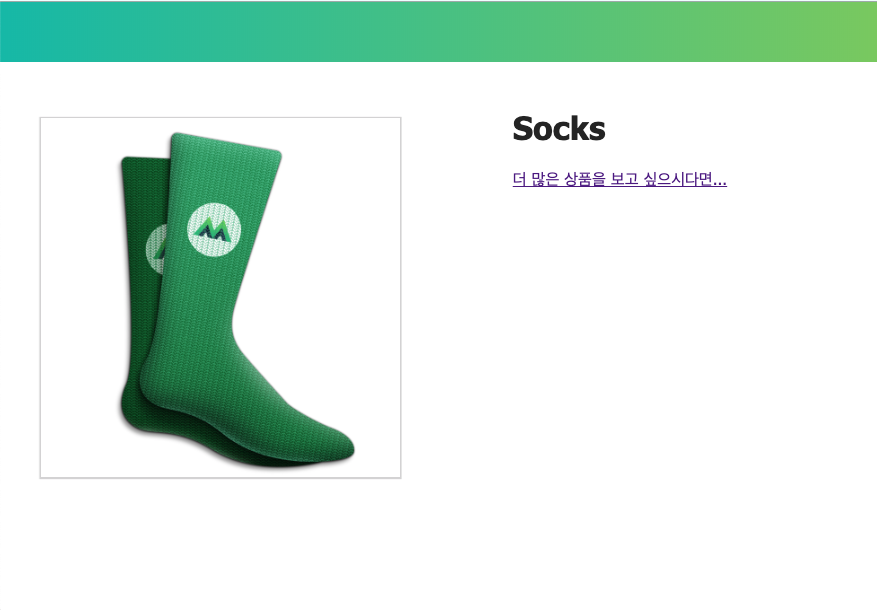
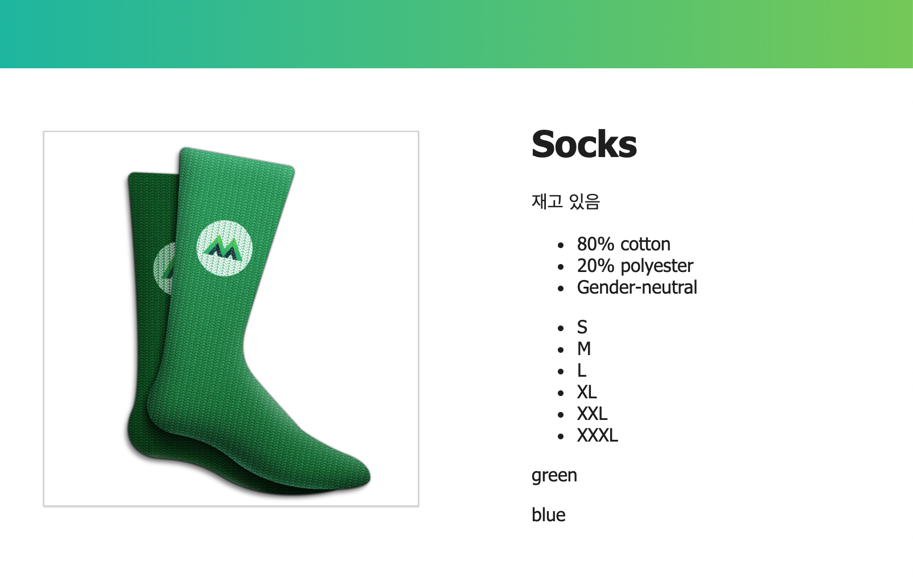
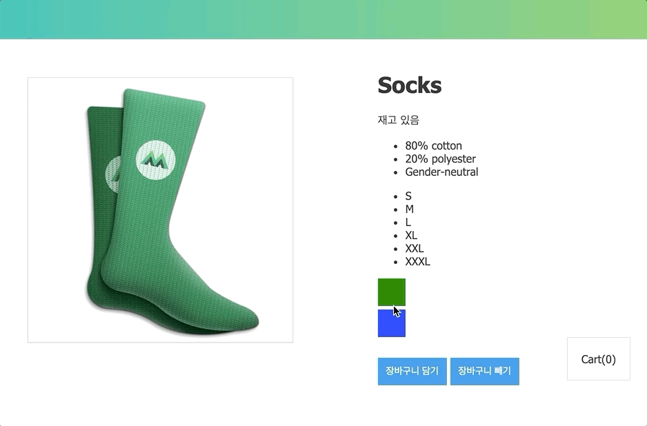

# 쇼핑몰 예제 코드 작성


- 작업폴더 만들기
  ```bash
  $> mkdir example1
  $> cd example1
  ## Visual Studio Code 실행
  $> code .
  ```
- `index.html` 생성
- 코드 입력
  ```html
  <!DOCTYPE html>
  <html lang="ko">

  <head>
    <meta charset="UTF-8">
    <meta name="viewport" content="width=device-width, initial-scale=1.0">
    <meta http-equiv="X-UA-Compatible" content="ie=edge">
    <title>ShoppingMall Example</title>
    <style>
      body{font-family:tahoma;color:#282828;margin:0}.nav-bar{background:linear-gradient(-90deg,#84cf6a,#16c0b0);height:60px;margin-bottom:15px}.product{display:flex}img{border:1px solid #d8d8d8;width:70%;margin:40px;box-shadow:0 .5px 1px #d8d8d8}.product-image{flex-basis:700px}.product-info{margin-top:10px;flex-basis:500px}.color-box{width:40px;height:40px;margin-top:5px}.cart{margin-right:25px;float:right;border:1px solid #d8d8d8;padding:5px 20px}button{margin-top:30px;border:none;background-color:#1e95ea;color:#fff;height:40px;width:100px;font-size:14px}.disabledButton{background-color:#d8d8d8}.review-form{width:30%;padding:20px;border:1px solid #d8d8d8}input{width:100%;height:25px;margin-bottom:20px}textarea{width:100%;height:60px}
    </style>
  </head>

  <body>
    <div class="nav-bar"></div>
    <div id="app">
      <div class="product">
        <div class="product-image">
          
        </div>
        <div class="product-info">
          <h1>{{ product }}</h1>
          <a :href="link" target="_blank">더 많은 상품을 보고 싶으시다면...</a>
        </div>
      </div>
    </div>

    <script src="https://cdn.jsdelivr.net/npm/vue/dist/vue.js"></script>
    <script>
      var model = {
        product: 'Socks',
        image: 'https://www.vuemastery.com/images/challenges/vmSocks-green-onWhite.jpg',
        link: 'https://www.amazon.com/s/ref=nb_sb_noss?url=search-alias%3Daps&field-keywords=socks'
      }

      var app = new Vue({
        el: '#app',
        data: model
      })
    </script>
  </body>

  </html>
  ```

> ### HTML은 주로 `<div class="product-info"></div>` 영역에 있는 코드만 수정할 예정이니 차근차근 잘 따라해 보시기 바랍니다 😎

# 디렉티브 (Directive)
## 선언적 렌더링 (`{{}}`, `v-text`, `v-html`)
**HTML Element 콘텐츠 영역 설정**

|Directive|Desc.|
|---|---|
|`v-text`, `{{}}`| innerText 속성에 연결됨|
|`v-html`|innerHtml 속성에 연결됨|

### Expression
```html
<h1>{{ product }}</h1>
<h1 v-text="product"></h1>
```

> `v-html`은 XSS 공격에 취약하기 때문에 사용할 상황을 만들면 안됨

## Attribute 바인딩 (`v-bind`)
**HTML Element 속성들을 바인딩**

### Expression
```html
<!-- 단축 표현법 -->

...
<a v-bind:href="link" target="_blank">More products like this</a>
```

## 조건부 렌더링 (`v-show`, `v-if`, `v-else`, `v-else-if`)
**Vue 객체의 data 속성 값에 따라 렌더링 여부를 결정하는 기능**

|Directive|Desc.|
|---|---|
|`v-if`| 조건에 맞지 않으면 렌더링 안함 |
|`v-show`| 일단 HTML Element를 렌더링 한 후 조건에 맞춰 display 스타일 속성 조정 |  

### 쇼핑몰 예제 코드 추가


- html
  ```html
  ...
  <div class="product-info">
    <h1>{{ product }}</h1>
    <p v-if="inStock">재고 있음</p>
    <p v-else>재고 없음</p>
  </div>
  ...
  ```
- javascript
  ```js
  // model에 데이터 추가
  var model = {
    product: 'Socks',
    image: 'https://www.vuemastery.com/images/challenges/vmSocks-green-onWhite.jpg',
    inStock: true,
  }
  ...
  ```

## 반복 렌더링 (`v-for`)
**리스트 같이 반복적인 데이터를 렌더링 할 때 사용**

### Expression
- 배열 데이터
  ```html
  <tr v-for="(contract, index) in contracts">
    <td>{{contract.no}}</td>
    <td>{{contract.name}}</td>
    <td>{{contract.tell}}</td>
    <td>{{contract.address}}</td>
  </tr>
  ```
- 객체 데이터
  ```html
  <option v-for="(val, key, index) in regions v-bind:value="key">
    {{ index+1 }} : {{ val }}
  </option>
  ```

### 쇼핑몰 예제 코드 추가


- html
  ```html
  ...
  <div class="product-info">
    ...
    <ul>
      <li v-for="detail in details">{{ detail }}</li>
    </ul>
    <ul>
      <li v-for="size in sizes">{{ size }}</li>
    </ul>
    <div v-for="variant in variants" :key="variant.variantId">
      <p>{{ variant.variantColor }}</p>
    </div>
  </div> 
  ```
- javascript
  ```js
  // model에 데이터 추가
  var model = {
    ...
    details: ['80% cotton', '20% polyester', 'Gender-neutral'],
    variants: [
      {
        variantId: 2234,
        variantColor: 'green',
        variantImage: 'https://www.vuemastery.com/images/challenges/vmSocks-green-onWhite.jpg'
      },
      {
        variantId: 2235,
        variantColor: 'blue',
        variantImage: 'https://www.vuemastery.com/images/challenges/vmSocks-blue-onWhite.jpg'
      }
    ],
    cart: 0,
    sizes: ['S', 'M', 'L', 'XL', 'XXL', 'XXXL']
  }
  ```

> `v-for` 구문 사용시 `key` Attribute를 부여하면 DOM요소를 추적하는 것이 가능해짐  
> `key` 값은 보통 고유한 값을 부여하게 됨(DB 조회 결과 값 같은 경우에는 Primary Key)  
> 일반적으로 `key` 값을 바인딩하면 좋지만 반드시 빨라진다고 보장할 순 없음

## 이벤트 핸들링 (`v-on`)
**`click`, `keyup`같은 HTML Element에서 발생하는 이벤트 처리**

### Expression
- 인라인 이벤트 핸들링
  ```html
  <button v-on:click="cart += 1">Add to cart</button>
  ```
- 이벤트 핸들러 메서드
  ```html
  <button v-on:click="addToCart">Add to cart</button>
  ...

  <script>
  var app = new Vue({
    el: '#app',
    data: model,
    methods: {
      addToCart() {
        this.cart += 1
      }
    }
  })
  </script>
  ```

### 쇼핑몰 예제 코드 추가


- html
  ```html
  ...
  <div class="product-info">
    ...
    <div v-for="variant in variants" :key="variant.variantId">
      <p @mouseover="updateProduct(variant.variantImage)">{{ variant.variantColor }}</p>
    </div>
    <button v-on:click="addToCart">장바구니 담기</button>
    <button @click="removeFromCart">장바구니 빼기</button>
    <div class="cart">
      <p>Cart({{ cart }})</p>
    </div>
  </div>
  ...
  ```
- javascript
  ```javascript
  // Vue 객체 옵션 중 methods 항목 추가
  var app = new Vue({
    el: '#app',
    data: model,
    methods: {
      addToCart() {
        this.cart += 1
      },
      updateProduct(variantImage) {
        this.image = variantImage
      },
      removeFromCart() {
        let c = parseInt(this.cart)
        if (c <= 0) {
          alert("장바구니가 비었습니다.")
        }
        else{
          this.cart -= 1
        }
      }
    }
  })
  ```

## Class & Style 바인딩
### 인라인 스타일 (`v-bind:style`)
- 왠만하면 인라인 스타일은 사용하지 않는 것이 좋음. (재사용성이 매우 떨어지고 관리가 안됨)
- `v-bind:style`로 스타일을 지정할 때 카멜 표기법을 사용해야 함
  
  |css(케밥 표기법)|javascript object(카멜표기법)|
  |-|-|
  |font-size|fontSize|
  |background-color|backgroundColor|

### CSS 클래스 바인딩 (`v-bind:class`)
- 개별적인 클래스 단위로 true가 되면 클래스가 주어짐

### 쇼핑몰 예제


- html
  ```html
  ...
  <div class="product-info">
    ...

    <div class="color-box" v-for="variant in variants" :key="variant.variantId"
      :style="{ backgroundColor: variant.variantColor }"
      @mouseover="updateProduct(variant.variantImage, variant.variantColor)">
    </div>

    <button v-on:click="addToCart" :disabled="!inStock" :class="{ disabledButton: !inStock }">장바구니 담기</button>
    <button @click="removeFromCart">장바구니 빼기</button>

    <div class="cart">
      <p>Cart({{ cart }})</p>
    </div>

  </div>
  ...
  ```

- javascript
  ```js
  updateProduct(variantImage, variantColor) {
    this.image = variantImage
    if(variantColor === 'blue'){
      this.inStock = false
    }
    else {
      this.inStock = true
    }
  },
  ```

## Computed 속성
템플릿 안에서는 단순한 연산만 사용이 가능하기 때문에 복잡한 계산식을 계산해서 return해 줄 수 있는 `computed` 속성 필요

- 템플릿
  ```html
  <!-- 템플릿에 복잡한 계산식을 넣으면 재사용성이 떨어지고 관리가 안됨 -->
  <div id="example">
    {{ message.split('').reverse().join('') }}
  </div>
  ```

- computed  
  - computed 속성은 계산된 값이 캐싱됨
  - computed 속성은 종속된 대상이 변경될 때만 함수가 실행됨
  ```html
  <div id="example">
    <p>원본 메시지: "{{ message }}"</p>
    <p>역순으로 표시한 메시지: "{{ reversedMessage }}"</p>
  </div>

  <script>
  var vm = new Vue({
    el: '#example',
    data: {
      message: '안녕하세요'
    },
    computed: {
      // 계산된 getter
      reversedMessage: function () {
        // `this` 는 vm 인스턴스를 가리킵니다.
        return this.message.split('').reverse().join('')
      }
    }
  })
  </script>
  ```

### 어디서 많이 본 듯한 표현법인데...(Computed vs Methods)
- methods
  ```js
  ...
  //computed 부분 대체
  methods: {
    reversedMessage: function () {
      return this.message.split('').reverse().join('')
    }
  }
  ...
  ```
> 최종 결과는 서로 동일하지만..  
> `reversedMessage` 를 `methods` 방식으로 만들면 `reversedMessage` 를 요청 할 때마다 함수가 재실행되고,  
`computed` 속성은 `message`가 변경되지 않는 한, `reversedMessage를` 여러 번 요청해도 다시 계산 하지 않고 캐싱값을 즉시 반환한다.

### 이와 비슷한 속성 중 Wathch 라는 관찰형 속성도 있는데 비동기 처리가 필요할 때 유용하다고만 알아두고 넘어가겠습니다.  
> 당연히 computed는 동기 처리를 하겠죠??

## 양방향 렌더링 (`v-model`)

## 기타 디렉티브

### `v-pre`
템플릿 문자열을 컴파일 하지 않고 문자열 그대로 출력

- Expression
  ```html
  <p v-pre>{{message}}</p>
  ```

### `v-once`
Html Element를 딱 한번만 렌더링 (초기값이 주어지면 변경 안됨)

- Expression
  ```html
  <p v-once>{{message}}</p>
  ```

### `v-cloak`
