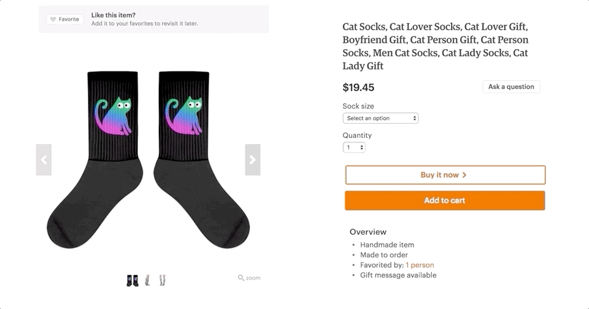
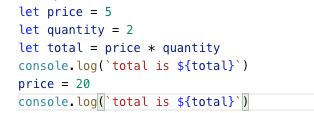
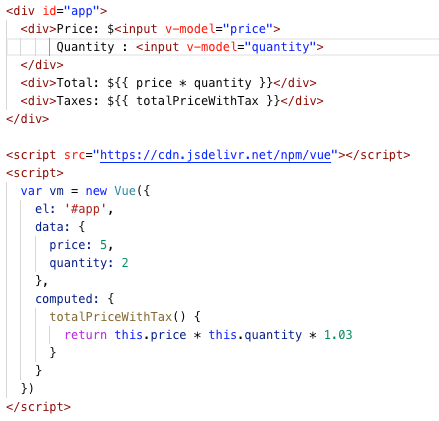
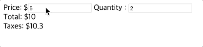

# Components
## 컴포넌트란?
- 재사용 가능한 코드 블럭
- 모듈화 및 관리가 용이한 코드베이스를 만드는데 도움이 됨

  

- Vue.js는 컴포넌트들을 조합하여 어플리케이션을 작성
- 컴포넌트들은 부모 자식 관계로 트리 구조 형성

  

  <sup>이미지 출처 : 
  [Cracking Vue.js](https://joshua1988.github.io/vue-camp/vue/components.html)
  </sup>

> 컴포넌트는 SPA(Single Page Application) 개발 시 가장 기본적이고 중요한 요소임

## 전역 컴포넌트
```js
Vue.component('product', {})
```
- 첫번째 인자값은 컴포넌트 명
- 두번째 인자는 컴포넌트의 option들을 설정 (type은 object)

### **data** 속성은 <span style="color:red">**함수**</span> 형태로 선언
```js
Vue.component('product', {
  template: `<div></div>`,
  data() {
    return {
    }
  },
  methods: {},
  computed: {}
})
```
> **컴포넌트별로 다른 data 속성을 가지기 위해서**  

## 지역 컴포넌트
- 전역 컴포넌트와는 달리 특정 지역에서만 사용가능한 컴포넌트  
  (아래 예제에서는 id 값이 `#app` 인 `div` 에서만 사용 가능)

- `Vue` 인스턴스 생성 시 `components` 옵션을 사용하여 등록
  ```js
  var Child = {
    template: '<div>사용자 정의 컴포넌트 입니다!</div>'
  }

  new Vue({
    el: '#app',
    components: {
      'my-component': Child
    }
  })
  ```

> 지역 컴포넌트는 [lecture_4](https://github.com/wooyoung85/vuejs-study/blob/master/lecture/lecture_4.md) 부터 주로 사용하게 될 예정입니다.  
> 아래 예제 코드들은 모두 전역 변수로 작성되었습니다 ^^

### 쇼핑몰 예제 코드 작성 (**Step_6**)

- [shop_step_6.html](https://github.com/wooyoung85/vuejs-study/blob/master/example/lecture3/shop_step_6.html) 파일 참고

## 컴포넌트 간 데이터 통신


<sup>이미지 출처 : 
[컴포넌트 — Vue.js](https://kr.vuejs.org/v2/guide/components.html)
</sup>

## Props
부모 컴포넌트에서 자식 컴포넌트로 데이터를 전달하는 방법 (**Pass Props**)

### Expression
- 부모 컴포넌트의 data 속성(`cellphone`) 값 전달
  ```html
  <!-- 부모 컴포넌트의 템플릿 -->
  <div id="app">
    <product v-bind:cellphone="cellphone"></product>
  </div>
  ```
- 자식 컴포넌트는 `props` 라는 속성으로 전달받음
  ```js
  // 자식 컴포넌트의 내용
  Vue.component('product', {
    ...
    props: ['cellphone'],
    ...
  })
  ```
- `props` 속성을 좀 더 명확하게 표현하고 싶다면 
  ```js
  props: {
    message: { type: String, default: 'Hello' },
    cellphone: { type: Object, required: true}
  }
  ```

### 데이터 전달 방향
데이터는 부모 👉자식 방향으로만 전달함

> **The two-way binding for props is being deprecated in Vue.js 2.0**   
> 1.0에서는 `.sync` 옵션을 써서 양방향 전달도 가능했지만  
> 시스템 복잡도가 상승하고 유지보수성이 매우 떨어져서 Vue.js 2.0 에서는 지원 안 함

### 쇼핑몰 예제 코드 작성 (**Step_7**)
- [shop_step_7.html](https://github.com/wooyoung85/vuejs-study/blob/master/example/lecture3/shop_step_7.html) 파일 참고

## Emit
자식 컴포넌트에서 부모 컴포넌트로 통신하는 방법 (**Emit Events**)

### Expression
- 자식 컴포넌트에서 event 발신
  ```js
  // 자식 컴포넌트의 내용
  this.$emit('add-to-cart');
  ```

- 부모 컴포넌트에서는 자식 컴포넌트가 발신한 이벤트 발생 시 실행할 method 정의
  ```html
  <!-- 부모 컴포넌트의 템플릿 -->
  <div id="app">
    <product v-on:add-to-cart="updateCart"></product>
  </div>
  ```

### 이벤트 발신 방법
자식 컴포넌트에서 사용자 정의 event를 만들고 event를 발생시키면  
부모 컴포넌트에서 event 핸들러 메서드를 호출하게 됨 

### 쇼핑몰 예제 코드 작성 (**Step_8**)
- [shop_step_8.html](https://github.com/wooyoung85/vuejs-study/blob/master/example/lecture3/shop_step_8.html) 파일 참고

### ⚠️ **주의사항**  
컴포넌트 작성 시 `props` 속성명을 작성할 때 🐫카멜 표기법(camel casing)을 사용했다면  
html tag 작성시에는 🍢케밥 표기법(kebob casing)을 사용해야만 오류가 나지 않음.

```html
...
<div id='app'>
  <!-- 이렇게 코드 작성하면 에러남 -->
  <product cellPhone="cellPhone"></product>
</div>
<template id='productTemplate'>
<template>
<script>
  Vue.component('product', {
    template: '#productTemplate',
    // 카멜 표기법으로 작성
    props: ['cellPhone']
  })
</script>
...
```

> tag 작성시 속성(위 예제에서 cellPhone)은 대소문자를 구분하지 않기 때문에 전부 소문자로 작성하거나 카멜 표기법을 사용해야 합니다. 

## EventBus
같은 레벨(형제 관계)에 있거나 아주 멀리 떨어진 컴포넌트들 간 정보를 주고 받기 위한 단일 통신 채널

### EventBus 통신 방법
- 빈 `Vue` 인스턴스 선언
  ```js
  var eventBus = new Vue()
  ```
- 이벤트 발신하는 컴포넌트
  ```js
  eventBus.$emit('add-to-cart', this.selectedVariant)
  ```

- 이벤트 수신하는 컴포넌트는 이벤트가 발생하면 실행할 event 핸들러 method를 등록해야 함
  ```js
  ...
  methods: {
    updateCart(id) {
      this.cartItems.push(id)
    },
  },
  created() {
    eventBus.$on('add-to-cart', this.updateCart);
  }
  ...
  ```

### 쇼핑몰 예제 코드 작성 (**Step_9**)
- [shop_step_9.html](https://github.com/wooyoung85/vuejs-study/blob/master/example/lecture3/shop_step_9.html) 파일 참고


> 실무에선 전역 Component를 사용할 일은 거의 없음  
> 주로 확장자가 `.vue` 인 **단일 파일 컴포넌트(Single File Component)** 형태로 많이 개발됨

# Vue.js Reactivity System
## 예제 코드
|#|Vanila Javascript|Vue.js|
|-|-|-|
|코드|||
|결과확인|||

> ### javascript는 절차적으로 코드를 처리하게 되는데 어떻게 `price` 나 `quantity` 값의 변화가 <br/> 이미 계산된 `total`, `totalPriceWithTax` 에 영향을 끼칠 수 있을까???

## 간단한 Reactivity System 구현 (with. `Dependency Class` & `Object.defineProperty`)
```js
let data = { price: 5, quantity: 2 }
let target = null

class Dep {
  constructor () {
    // 특정 변수에 종속적인 target(구독자)들의 집합  
    this.subscribers = [] 
  }
  depend() {  
    if (target && !this.subscribers.includes(target)) {
      // target이 있으면서 신규로 subscribe하는 경우에만 subscribers에 push
      this.subscribers.push(target)
    } 
  }
  notify() {
    // 특정 변수의 값이 setter에 의해 변경되면 notify()를 Call하게 되고, target(구독자)들이 실행됨
    this.subscribers.forEach(sub => sub())
  }
}

// data 속성별로 실행됨
Object.keys(data).forEach(key => {
  let internalValue = data[key]
  
  // 당연히 data 속성별로 dependency instance가 생김
  const dep = new Dep()
  
  Object.defineProperty(data, key, {
    get() {
      // target들이 dependency를 갖도록 하는 작업
      // Collect Dependencies
      dep.depend() 
      return internalValue
    },
    set(newVal) {
      internalValue = newVal
      // 구독 중인 target들이 실행됨
      // Notify
      dep.notify() 
    }
  })
})

function watcher(myFunc) {
  target = myFunc
  target()
  target = null
}

var totalfunc = function() {
  data.total = data.price * data.quantity
}

watcher(totalfunc)
```
- Vue 인스턴스가 초기화 될 때 data(javascript object)에 있는 모든 속성별로  `Object.defineProperty()` 메서드를 사용하여 getter/setter 설정
- watcher 함수가 파라미터로 전달받은 target 함수를 실행하게 되면 dependency가 생김
- 위 예제로 좀 더 자세히 설명해 본다면..
  1. watcher가 total 함수를 실행 
  2. price와 quantity 값을 각각의 getter로 호출
  3. 이때 getter 함수는 target 함수를 각 data 속성 별로 subscribers에 등록

- data 속성 값을 변경하기 위해 setter를 이용하게 됨
- setter가 호출되면 내부 데이터를 변경하고 dependency가 있는 target 함수들을 실행함

```js
> data.total
10
> data.price = 200
200
> data.total
400
```

> 대략적으로 이런 작업을 거쳐 data에 있는 속성들은 **반응(reactive) 속성**이 된다

## 실제 Vue.js Reactivity System


- 각 Component별로 Watcher 인스턴스를 가지게 됨
- Watcher는 각 속성별로 getter 호출 시 dependency가 있는 target function 들을 수집함
- Watcher는 Virtual DOM에 변경사항을 기록하고 re-render 를 명령함(비동기)


## 만약에 인스턴스 속성이 동적으로 추가된다면??
👉 이미 만들어진 인스턴스에 반응 속성을 동적으로 추가하는 것은 허용되지 않음
```js
// 위 예제에 이어서 코드 작성 
> data.totalWithTax = data.price * data.quantity * 1.2
480
// 이후 price나 quantity 값을 변경해도 totalWithTax 값은 변화 없음 (total 값만 변함)
> data.price = 150
150
> data.total
300
> data.totalWithTax
480
```
> 하지만 이 경우에도 `Vue.set(object, key, value)` 메소드를 사용하여 변경사항을 감지하게 할 수 있음

## 비동기 갱신 큐(Queue)
- 사용자가 데이터를 변경하면 Watcher가 관리하는 Virtual DOM에는 즉시 반영됨
- but, DOM 조작을 최소화 하기 위해 모든 데이터 변경 사항은 버퍼링 됨  
  (버퍼링으로 중복이 제거된 작업)
- 버퍼링을 거쳐서 큐에 푸시가 되면 이벤트 루프 tick이 큐에 있는 내용을 Flush하면서 실제 DOM을 업데이트 함

## Vue는 DOM 업데이트를 비동기로 동작한다는데 문제는 없을까?
일반적으로는 문제가 없겠지만 렌더링 된 값에 의존하는 로직이 있다면 문제가 생길수도 있음

### 해결책
- `Vue.nextTick()` 
- `this.$nextTick()` 👈 Vue 인스턴스 내부에서 사용시

### 예제코드
```html
<div id="app">
  <div id="num">{{num}}</div>
  <button @click="add">100씩 증가</button>
</div>
<script src="https://cdn.jsdelivr.net/npm/vue/dist/vue.js"></script>
<script>
  var getfunc = function () {
    var strNum = document.getElementById("num").innerHTML;
    console.log(strNum);
  }

  var vm = new Vue({
    el: "#app",
    data: {
      num: 100
    },
    methods: {
      add: function () {
        this.num += 100
        getfunc()
        //this.$nextTick(getfunc);
      }
    }
  })
</script>
```

## 참고자료
[Vue.js 퀵 스타트](http://www.yes24.com/Product/Goods/45091747)  
[stepanowon/vuejs_book_2nd: Vue.js QuickStart 2판](https://github.com/stepanowon/vuejs_book_2nd)  
[Our Courses | Vue Mastery](https://www.vuemastery.com/courses/)  
[[Vue.JS] 컴포넌트 (기본)](https://beomy.tistory.com/55)  
[API — Vue.js](https://kr.vuejs.org/v2/api/index.html#Vue-nextTick)  
[Vue.js에서 nextTick 사용하기](http://vuejs.kr/jekyll/update/2017/01/19/vuejs-nexttick-example/)  
[Passing Data from parent to child with props](https://riptutorial.com/vue-js/example/10471/passing-data-from-parent-to-child-with-props)