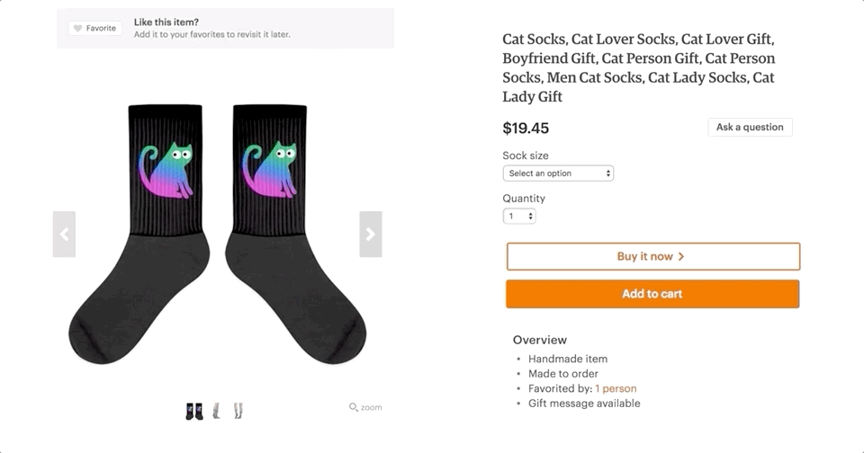
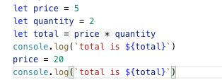
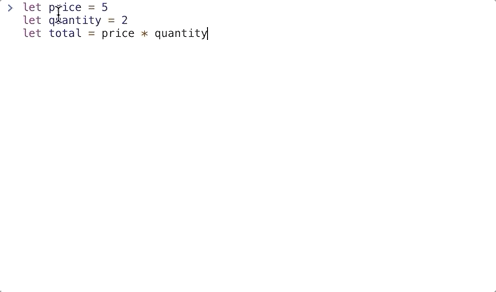

# Components
## 정의
- 재사용 가능한 코드 블럭
- 모듈화하고 관리가 용이한 코드베이스를 만드는데 도움이 됨



> 컴포넌트는 SPA(Single Page Application) 개발 시 가장 기본적이고 중요한 요소임

## 전역 컴포넌트

### 쇼핑몰 예제 코드 작성 (**Step_6**)
- [shop_step_6.html](https://github.com/wooyoung85/vuejs-study/blob/master/example/lecture3/shop_step_6.html) 파일 참고

## 지역 컴포넌트

## Props

## Emit

## EventBus

### 쇼핑몰 예제 코드 작성 (**Step_7**)
- [shop_step_7.html](https://github.com/wooyoung85/vuejs-study/blob/master/example/lecture3/shop_step_7.html) 파일 참고


# Vue.js Reactivity System
## 예제 코드
|#|Vanila Javascript|Vue.js|
|-|-|-|
|코드|||
|결과확인|||

> ### javascript는 절차적으로 코드를 처리하게 되는데 어떻게 `price` 나 `quantity` 값의 변화가 <br/> 이미 계산된 `total`, `totalPriceWithTax` 에 영향을 끼칠 수 있을까???

## 간단한 Reactivity System 구현 (with. `Dependency Class` & `Object.defineProperty`)
```js
let data = { price: 5, quantity: 2 }
let target = null

class Dep {
  constructor () {
    // 특정 변수에 종속적인 target(구독자)들의 집합  
    this.subscribers = [] 
  }
  depend() {  
    if (target && !this.subscribers.includes(target)) {
      // target이 있으면서 신규로 subscribe하는 경우에만 subscribers에 push
      this.subscribers.push(target)
    } 
  }
  notify() {
    // 특정 변수의 값이 setter에 의해 변경되면 notify()를 Call하게 되고, target(구독자)들이 실행됨
    this.subscribers.forEach(sub => sub())
  }
}

// data 속성별로 실행됨
Object.keys(data).forEach(key => {
  let internalValue = data[key]
  
  // 당연히 data 속성별로 dependency instance가 생김
  const dep = new Dep()
  
  Object.defineProperty(data, key, {
    get() {
      // target들이 dependency를 갖도록 하는 작업
      // Collect Dependencies
      dep.depend() 
      return internalValue
    },
    set(newVal) {
      internalValue = newVal
      // 구독 중인 target들이 실행됨
      // Notify
      dep.notify() 
    }
  })
})

function watcher(myFunc) {
  target = myFunc
  target()
  target = null
}

var totalfunc = function() {
  data.total = data.price * data.quantity
}

watcher(totalfunc)
```
- Vue 인스턴스가 초기화 될 때 data(javascript object)에 있는 모든 속성별로  `Object.defineProperty()` 메서드를 사용하여 getter/setter 설정
- getter 호출 시 dependency가 있는 target function 을 수집함
- data 속성 값을 변경하기 위해 setter를 이용하게 됨
- setter가 호출되면 내부 데이터를 변경하고 dependency가 있는 target function들을 실행함

> 대략적으로 이런 작업을 거쳐 data에 있는 속성들은 **반응(reactive) 속성**이 된다

## 실제 Vue.js Reactivity System


- 각 Component별로 Watcher 인스턴스를 가지게 됨
- Watcher는 각 속성별로 getter 호출 시 dependency가 있는 target function 들을 수집함
- Watcher는 Virtual DOM에 변경사항을 기록하고 re-render 를 명령함(비동기)


## 만약에 인스턴스 속성이 동적으로 추가된다면??
👉 이미 만들어진 인스턴스에 반응 속성을 동적으로 추가하는 것은 허용되지 않음
```js
var vm = new Vue({
  data: {
    a: 1
  }
})
// vm.a 는 반응적임
 
vm.b = 2
// vm.b 를 변경하면 화면변화 없음
```
> 하지만 이 경우에도 `Vue.set(object, key, value)` 메소드를 사용하여 변경사항을 감지하게 할 수 있다.

## 비동기 갱신 큐(Queue)
- 사용자가 데이터를 변경하면 Watcher가 관리하는 Virtual DOM에는 즉시 반영됨
- but, DOM 조작을 최소화 하기 위해 모든 데이터 변경 사항은 버퍼링 됨  
  (버퍼링으로 중복이 제거된 작업)
- 버퍼링을 거쳐서 큐에 푸시가 되면 이벤트 루프 tick이 큐에 있는 내용을 Flush하면서 실제 DOM을 업데이트 함

## Vue는 DOM 업데이트를 비동기로 동작한다는데 문제는 없을까?
일반적으로는 문제가 없겠지만 렌더링 된 값에 의존하는 로직이 있다면 문제가 생길수도 있음

### 해결책
- `Vue.nextTick()` 
- `this.$nextTick()` 👈 Vue 인스턴스 내부에서 사용시

### 예제코드
```html
<div id="app">
  <div id="num">{{num}}</div>
  <button @click="add">100씩 증가</button>
</div>
<script src="https://cdn.jsdelivr.net/npm/vue/dist/vue.js"></script>
<script>
  var getfunc = function () {
    var strNum = document.getElementById("num").innerHTML;
    console.log(strNum);
  }

  var vm = new Vue({
    el: "#app",
    data: {
      num: 100
    },
    methods: {
      add: function () {
        this.num += 100
        getfunc()
        //this.$nextTick(getfunc);
      }
    }
  })
</script>
```

## 참고자료
[Vue.js 퀵 스타트](http://www.yes24.com/Product/Goods/45091747)  
[stepanowon/vuejs_book_2nd: Vue.js QuickStart 2판](https://github.com/stepanowon/vuejs_book_2nd)  
[Our Courses | Vue Mastery](https://www.vuemastery.com/courses/)  
[[Vue.JS] 컴포넌트 (기본)](https://beomy.tistory.com/55)  
[API — Vue.js](https://kr.vuejs.org/v2/api/index.html#Vue-nextTick)  
[Vue.js에서 nextTick 사용하기](http://vuejs.kr/jekyll/update/2017/01/19/vuejs-nexttick-example/)