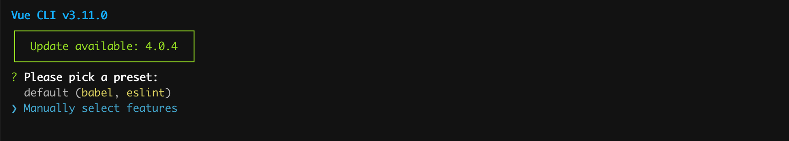
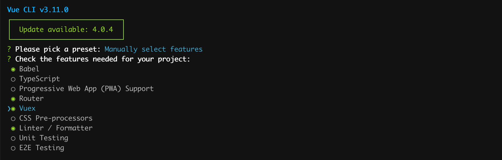
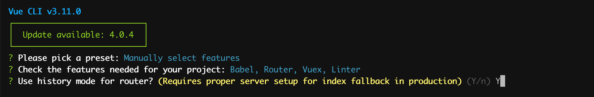
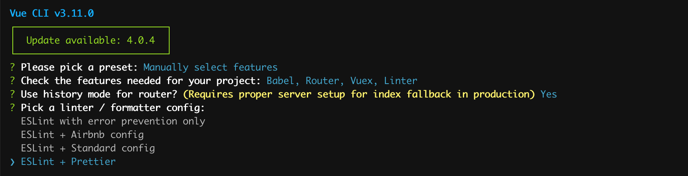
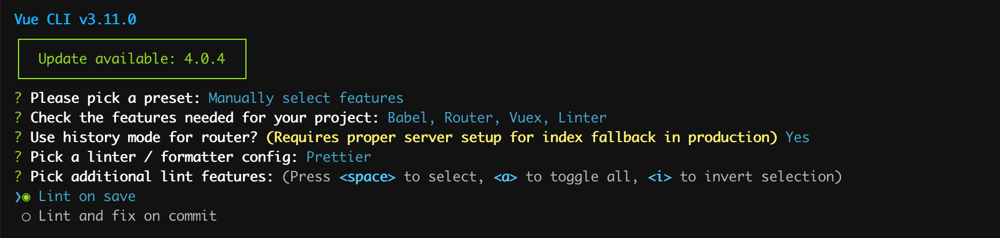
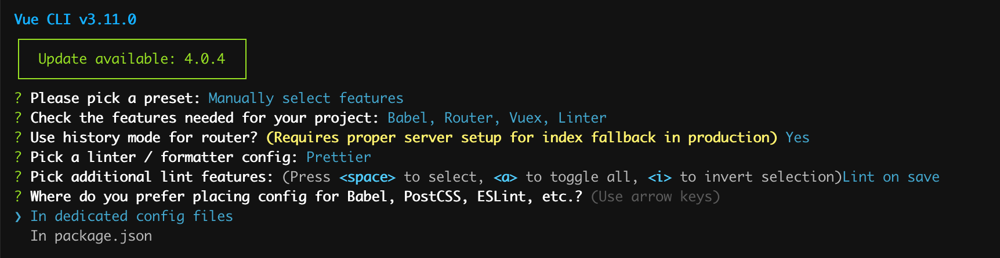
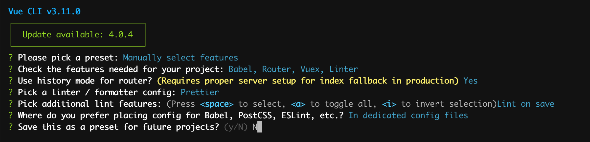
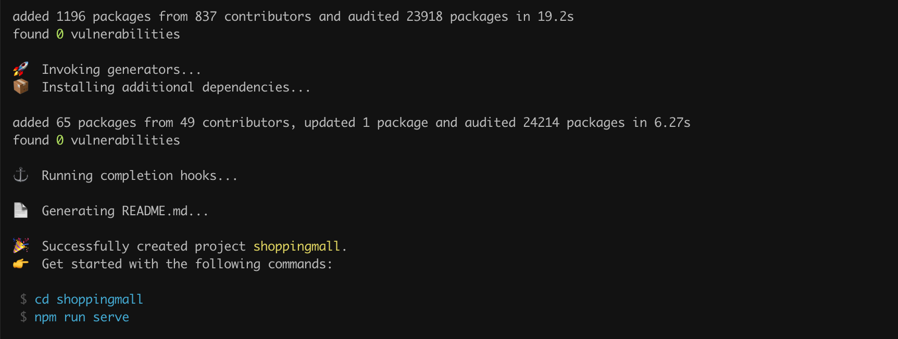

# 진짜 Vue.js 개발 시작하기

# Vue CLI
- Vue.js 개발 환경을 빠르고 쉽게 제공
- 공식 지원되는 도구
- `project scffoding` 제공 (👉 프로젝트 폴더 구조 및 라이브러리 설정)
- Vue CLI를 쓰지 않고 직접 설정도 가능하지만 추천 ❌

> 현재 `v4.0.0-rc.7` 까지 Pre-release 된 상태이지만 `3.x` version을 사용할 예정입니다.

# Vue CLI 구성요소
## CLI
- `vue` 명령어 제공

  |command|desc|
  |-|-|
  |**create** [options] <app-name> |create a new project powered by vue-cli-service|
  |**add** [options] <plugin> [pluginOptions]|install a plugin and invoke its generator in an already created project|
  |**invoke** [options] <plugin> [pluginOptions]|invoke the generator of a plugin in an already created project|
  |**inspect** [options] [paths...]|inspect the webpack config in a project with vue-cli-service|
  |**serve** [options] [entry]|serve a .js or .vue file in development mode with zero config|
  |**build** [options] [entry]|build a .js or .vue file in production mode with zero config|
  |**ui** [options]|start and open the vue-cli ui|
  |**init** [options] \<template> \<app-name>|generate a project from a remote template (legacy API, requires @vue/cli-init)|
  |**config** [options] [value]|inspect and modify the config|
  |**upgrade** [semverLevel] | upgrade vue cli service / plugins (default semverLevel: minor)|
  |**info**|print debugging information about your environment|

## CLI Service

- 복잡한 `webpack` 설정을 알아서 해줌 
- `webpack-dev-server` 를 사용하여 Hot Module Replacement 가 가능하도록 함  
  (👉 코드를 저장하면 브라우저에 바로 반영)
- `package.json` 에 정의되어 있음
  |command|desc|
  |-|-|
  |serve|start development server|
  |build|build for production|
  |inspect|inspect internal webpack config|
  |lint|lint and fix source files|

> react의 `react-scripts` 와 유사한 개념  
> 참고자료 : [What exactly is the 'react-scripts start' command?](https://stackoverflow.com/questions/50722133/what-exactly-is-the-react-scripts-start-command)


## Vue CLI 설치
```bash
npm i -g @vue/cli
```

> Mac OS 사용 시 앞에 `sudo` 붙여야 함

> 😎 `lecture_1` 에서 설치했다면 Pass  

## Project 만들기
```bash
vue create shoppingmall
```

<iframe src="https://player.vimeo.com/video/367217922" width="640" height="480" frameborder="0" allow="autoplay; fullscreen" allowfullscreen></iframe>

### preset (수동)설정
- 추가적인 설정을 해줘야 하기 때문에 Manually 선택
  

- `Router`, `Vuex` 추가 선택 (이 둘은 거의 필수라고 보면 됨)
  
  
- history 모드 사용
  vue-router의 기본 모드는 hash mode
  
  
- linter / formatter 는 `ESLint + Prettier`로 설정
  

- 추가적인 lint 설정
  

- Babel, PostCSS, ESLint 등의 설정 파일은 전용 설정 파일 생성
  

- 이렇게 설정한 값들을 저장 가능하지만 여기서는 N 선택
  

- 프로젝트 생성 완료
  

## Webpack
Webpack 👉 module bundler
여러 파일을 하나로 묶어주는 기능

.vue 파일은 브라우저가 인식할 수 없음
loader와 plugin을 사용하여 html, css, js로 변환

vue 단일 파일 컴포넌트를 사용하기 위해서는 .vue 파일을 컴파일하고 번들링하는 작업이 필요합니다.


## Webpack 을 좀 더 이해하기 위한 실습 예제
### 실습을 위한 기본 설정
  ```bash
  mkdir webpack-demo-app
  cd webpack-demo-app

  # package.json 파일 만들기
  npm init -y

  # webpack, lodash 설치
  npm install -D webpack webpack-cli
  npm install lodash
  ```
### package.json 수정
```diff
"scripts": {
+   "build": "webpack",
    "test": "echo \"Error: no test specified\" && exit 1"
  },
```

### `webpack.config.js` 파일 생성
```js
const path = require('path')

module.exports = {
  entry: {
    app: path.join(__dirname, 'index.js')
  },
  output: {
    path: path.join(__dirname, 'dist'),
    filename: 'build.js'
  },
};
```


### `index.html`, `index.js` 파일 생성
index.html
```html
<html>
  <head>
    <title>webpack demo app</title>
  </head>
  <body>
    <script src="./dist/build.js"></script>
  </body>
</html>
```

index.js
```js
import _ from 'lodash';

function component() {
  var element = document.createElement('div');

  element.innerHTML = _.join(['Hello', 'webpack'], ' ');

  return element;
}

document.body.appendChild(component());
```

### webpack 실행
```bash
npm run build
```


# Vue Router

# Vue Components

# API 호출 (with. Axios)

## 참고자료
[Vue CLI](https://cli.vuejs.org/)  
[[Vue] 개발환경 만들기 (without vue-cli)](https://velog.io/@kyusung/Vue-app-sfc-without-vue-cli)  
[Vue CLI 3.X 사용하기](https://velog.io/@skyepodium/Vue-CLI-3.X-%EC%82%AC%EC%9A%A9%ED%95%98%EA%B8%B0)