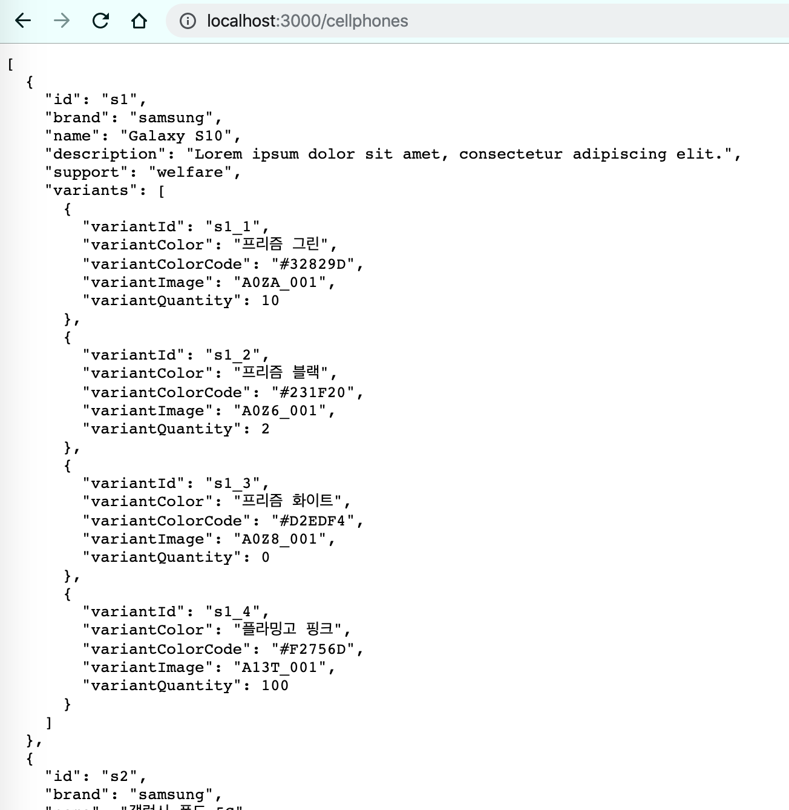
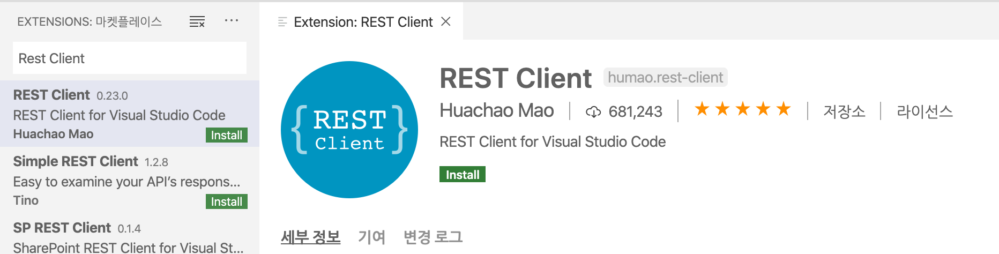
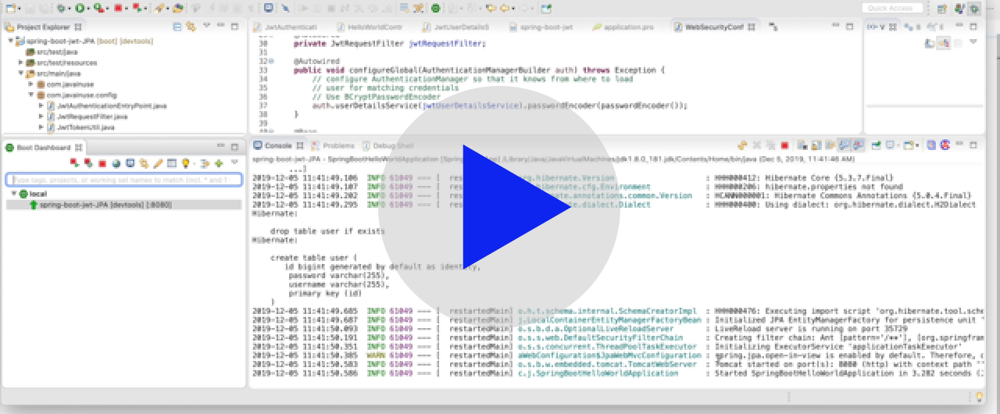
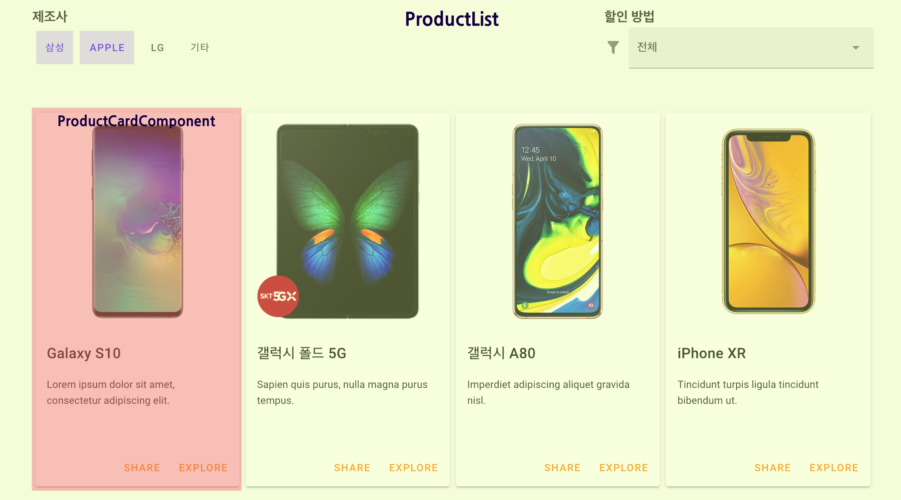
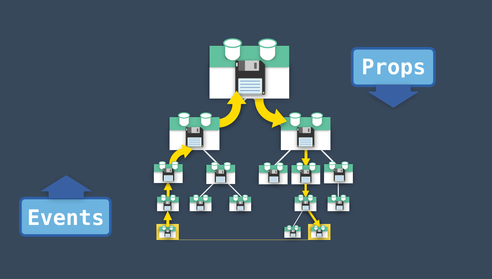
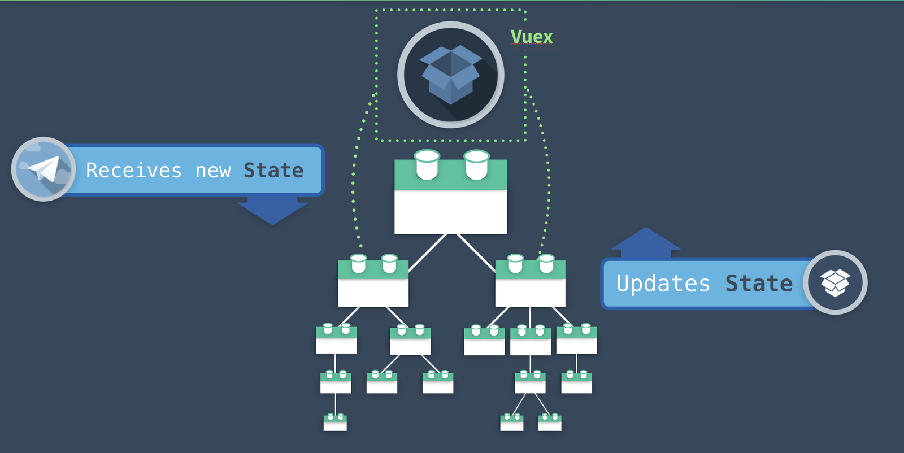
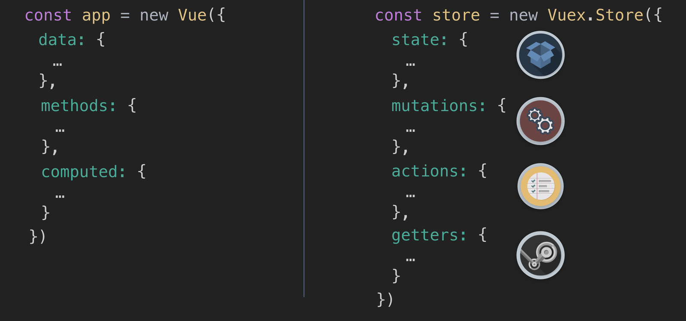

# API 호출 (with. Axios)

## Mock API Server
- `db.json` 파일 만들기 ([파일 내용은 github 참고](https://github.com/wooyoung85/vuejs-sample-project/blob/master/db.json))

- `json-server` Install
  ```bash
  $> npm install -g json-server

  $> json-server --watch db.json

  \{^_^}/ hi!

  Loading db.json
  Done

  Resources
  http://localhost:3000/cellphones

  Home
  http://localhost:3000

  Type s + enter at any time to create a snapshot of the database
  Watching...
  ```
- 브라우저에서 확인
  

## Rest Client Install
> API 테스트를 위해 PostMan 같은 Tool을 일반적으로 많이 사용하지만  
Visual Studio Code Extention 중 매우 괜찮은 Tool이 있어서 사용해 보려고 합니다 ^^

### Extension Install


### 사용하기
- 테스트 작성
  ```json
  POST http://localhost:8080/register
  Content-Type: application/json

  {
    "username": "test",
    "password": "password"
  }
  ```
- Send Request

  [](https://player.vimeo.com/video/377469256)

## Install Axios
```bash
$> npm install axios
```

## Axios 사용하기
> Axios 란? 👉 Promise based HTTP client for the browser and node.js

### 📱`ProductList` Component에 뿌릴 데이터를 원격 API 에서 받아오는 예제



### Component에서 axios 직접 사용하기
- `ProductList` 수정
  ```html
  <template>
    ...
    <product-card-component v-for="(product, index) in products" :key="index" :product="product" />
  </template>
  ...
  <script>
  import ProductCardComponent from "../components/ProductCardComponent";
  import axios from "axios";

  export default {
    components: { ProductCardComponent },
    data() {
      return {
        products: [],
      }
    }
    created() {
      axios
        .get("http://localhost:3000/cellphones")
        .then(response => {
          this.products = response.data;
        })
        .catch(error => {
          console.log("Error Message :", error.response);
        });
    }
  }
  </script>
  ```

### Service로 분리하기
- `src/services/ProductService.js` 만들기
  ```js
  import axios from 'axios'
      
  const apiClient = axios.create({  
    baseURL: `http://localhost:3000`,
    withCredentials: false,
    headers: {
      Accept: 'application/json',
      'Content-Type': 'application/json'
    }
  })

  export default {
    getCellphones() {
      return apiClient.get('/cellphones')
    }
  }
  ```
- `ProductList` 수정
  ```html
  <script>
  import ProductCardComponent from "../components/ProductCardComponent";
  import ProductService from '@/services/ProductService.js'

  export default {
    ...
    created() {
      ProductService.getCellphones()
        .then(response => {
          this.products = response.data;
        })
        .catch(error => {
          console.log("Error Message:", error.response)
        })
    }
  }
  </script>
  ```


# Vue Router

## Server-side Routing(MPA) VS Client-side Routing(SPA)

|MPA|SPA|
|-|-|
|||

<sup>이미지 출처 : [Vue Mastery-facebook](https://www.facebook.com/vuemastery/photos/a.2088441761371177/2269031573312194/?type=3)</sup>

### Server-side Routing(MPA)
- client 가 URL을 변경 요청할 때마다 서버로 요청이 가고 서버로부터 페이지를 Return 받는 방식

### Client-side Routing(SPA)
- SPA에서 컨텐츠를 탐색하기 위한 방식  
(SPA는 하나의 페이지에서 모든 리소스들을 로드한 후 다이나믹하게 화면을 업데이트 함)

> 이번 강의에서는 `Client-side Routing`에 대해 학습할 예정이고 추후 SSR(Server Side Rendering)에 대해 다룰 예정임

> Vue 에서는 `VueRouter`라는 공식 Routing Solution을 제공함

## Vue Router Install
### Vue CLI
```bash
$> vue add router
```
- `vue-cli` 로 프로젝트를 만들면서 `Router` 를 추가하지 않았을 경우에만  
 `vue add` 를 통해 추가하면 됨

### NPM
```bash
$> npm install vue-router
```
- `npm` 으로 설치할 경우 약간의 추가 설정이 필요함   
(👇자세한 내용은 바로 밑에 설명)

## Project에 어떻게 추가되어야 하는지 확인

### `package.json` 
```json
"dependencies": {
    "vue": "^2.6.10",
    "vue-router": "^3.1.3",
    ...
  },
```

### `router.js` 
#### 필요한 Library Import
```js
import Vue from "vue";
import VueRouter from "vue-router";
import HomeComponent from "../views/HomeComponent.vue";
```
- `vue` 와 `vue-router` 는 반드시 import
- routing 해 줄 컴포넌트들도 import 해야 함 (dynamic import 방식도 지원)

#### 명시적 사용 선언
```js
Vue.use(VueRouter);
```
- `Vue.use()` 를 통해 명시적으로 라우터를 추가해야 사용 가능

#### Routing 설정
```js
const routes = [
  {
    path: "/",
    name: "home",
    component: HomeComponent
  },
  ...  
];

const router = new VueRouter({
  mode: "history",
  base: process.env.BASE_URL,
  routes
});
```
- `routes` 에 routing 요소들을 추가 
- `new VueRouter()`할 때 mode는 `history` 모드 선택하는 것을 추천

  > `Vue Router` 는 기본적으로 `hash` 모드 (`#` 을 기준으로 routing이 되는 것) 를 지원하지만  
  > `history` 모드를 사용하는 것이 좀 더 익숙하고 직관적인 방법인 것 같습니다 ^^

#### Module Export
```js
export default router;
```

### `main.js`
#### 필요한 Library Import
```js
import Vue from "vue";
import App from "./App.vue";
import router from "./router";
```

#### router Module 사용
```js
new Vue({
  router,
  render: h => h(App)
}).$mount("#app");
```

## Route 설정 자세히 알아보기
### 기본적인 속성
- **path** : 사용자가 연결될 실제 경로
- **name** : route의 이름
- **component** : 해당 경로에서 렌더링 할 컴포넌트를 지정

  ```js
  const router = new VueRouter({
    routes: [
      {
        path: "/users",
        name: "users",
        component: UsersComponent,
      },
      ...  
    ]
  })
  ```
  > `name` 을 사용하여 routing 하는 것이 좀 더 유연하고 편리함

### `/products/1` 같이 path parameter 를 사용하려면 어떻게 해야 할까❓
- routes 속성 설정 시 아래와 같이 `path` 에 `:parameter` 추가
  ```js
  const router = new VueRouter({
    routes: [
      {
        path: '/products/:productId',
        name: 'productDetail',
        component: ProductDetail,
      }
    ]
  })
  ```

### 🤦`/about` 과 `/about-us` 가 동일한 Component를 로드해야 할 경우

- `redirect` 속성 사용
  ```js
  const router = new VueRouter({
    routes: [
      { 
        path: '/about-us', 
        redirect: { name: "about" }
      },
    ]
  })
  ```

- `alias` 속성 사용
  ```js
  const router = new VueRouter({
    routes: [
      {
        path: '/about',
        name: 'about',
        component: About,
        alias: '/about-us'
      }
    ]
  })
  ```


## Vue Router 사용하기
### `App.vue`
```html
<template>
  <header>
    <nav>
      <router-link to="/">Home</router-link>
      <router-link to="{ name: 'about' }">About</router-link>
      <router-link to="{ name: 'product'}">Products</router-link>
    </nav> 
  </header>   
  <main>
    <router-view />
  </main>  
</template>
```

#### `<router-link>`
- Vue Router 가 제공하는 컴포넌트 (전역에서 사용 가능)
- to 속성 작성 시 `path` 뿐만 아니라 `name` 을 활용하여 routing 가능

  > `<router-link>`의 `to` 속성 값을 작성할 때 name을 활용하는 것이 좀 더 유연한 방법이 될 수 있음  
  > (각각의 컴포넌트들을 수정할 필요 없이 `router.js` 만 잘 관리하면 되기 때문)

#### `<router-view />`
- routing 될 컴포넌트가 페이지에 렌더링 될 자리 표시 (place holder 역할)

### `params` 사용하기
- `router-link` 에 `params` 객체를 같이 선언
  ```html
  <router-link :to="{ name: 'productDetail', params: { productId: 123, productCode: 'S001' }}">ProductDetail</router-link>
  ```

- `ProductDetail.vue` 
  ```html
  <template>
    <h1>상품 상세 화면</h1>
    <p>상품 ID : {{ this.$route.params.productId }} </p>
    <p>상품코드 : {{ this.$route.params.productCode }}</p>
  </template>
  ```

  > `this.$route` 를 통해 현재 라우트 정보를 확인할 수 있고 `$route` 는 `path, params, query` 같은 속성들을 가지고 있음

  > ⚠️ 주의사항  
  `this.$router` 는 `router.js` 에서 `new VueRouter()` 를 통해 생성한 router를 가리키는 객체임

### `query` 사용하기
- `router-link` 에 `query` 객체를 같이 선언
  ```html
  <router-link :to="{ path: 'product', query: { company: 'apple', support: 'welfare' }}">Products</router-link>
  ```

- `ProductList.vue` 파일 수정  

  ```html
  <template>
    <h1>상품 리스트</h1>
    <p>회사 : {{ this.$route.query.company }} </p>
    <p>지원방법 : {{ this.$route.query.support }}</p>
  </template>
  ```

> 외부에서도 접근 가능하도록 하기 위해서는 `path parameter` 를 지원하거나 `query` 방식을 지원해야 함  
(params 방식은 외부 접근 X)


# Code Splitting & Lazy Loading


<sup>이미지 출처 : [자이언트 펭TV](https://www.youtube.com/channel/UCtckgmUcpzqGnzcs7xEqMzQ)</sup>

> SPA 로 작성한 어플리케이션의 규모가 점점 커진다면  
화면 렌더링을 위한 초기 리소스를 다운받는 부담이 매우 커지기 때문에  
`code-splitting` 을 통한 `Lazy loading` 에 대한 고려가 필요함!! 🤔

## Code Splitting
```js
const ProductList = () => import("../views/ProductList.vue")

const router = new VueRouter({
  routes: [
    {
      path: "/product",
      name: "product",
      component: ProductList
    }
  ]
})
```
- component 속성 선언 시 `dynamic import` 형태로 작성할 경우 별도의 파일로 번들링 됨
- `npm run build` 를 실행하면 `dist` 폴더 밑에 별도의 배포용 파일이 떨어지게 됨

  


```js
const ProductList = () => import(/* webpackChunkName: "product" */ '../views/ProductList.vue')
const ProductDetail = () => import(/* webpackChunkName: "product" */ '../views/ProductDetail.vue')
```
- 여러 컴포넌트들을 하나의 그룹으로 묶어서 번들링 하고 싶다면 `dynamic import` 구문에 `webpackChunkName` 을 같이 작성해 주면 됨

<div class="es6_box">

### ES6 Shortcut
```js
// ES5
const ProductList = function() {
  return import("../views/ProductList.vue")
}

// ES6 (Arrow Function)
const ProductList = () => { return import(/* webpackChunkName: "product" */ "../views/ProductList.vue")}

// ES6 Shortcut (return 되는 인자가 하나일 경우)
const ProductList = () => import(/* webpackChunkName: "product" */ '../views/ProductList.vue')
```
</div>


## Lazy Loading
route 설정 시 `dynamic import` 형태로 component 속성을 선언했다면  
처음부터 모든 자원을 Loading 하는 것이 아니라 해당 경로 요청 시 필요한 자원을 load 하게 됨

> but, pre-fetch 기능을 끄지 않으면 lazy loading을 제대로 테스트 할 수 없음 😅

## pre-fetch
- dynamic import를 통해 만들어진 분리된 chunk 파일들이 html 상단에 pre-fetch로 태그됨
- pre-fetch 로 선언된 리소스들은 브라우저가 미리 캐시하게 됨
- vue-cli3 부터 지원하는 기능

  ```html
  <!DOCTYPE html>
  <html lang="en">
    <head>
      ...
      <link href="/js/product.js" rel="prefetch">
      <link href="/js/app.js" rel="preload" as="script">
      <link href="/js/chunk-vendors.js" rel="preload" as="script">
    </head>
    <body>
      <div id="app"></div>
      <!-- built files will be auto injected -->
      <script type="text/javascript" src="/js/chunk-vendors.js"></script>
      <script type="text/javascript" src="/js/app.js"></script>
    </body>
  </html>
  ```


- `vue.config.js` 수정
  ```js
  module.exports = {
    ...
    // prefetch 기능 off
    chainWebpack: (config) => {
      config.plugins.delete('prefetch')
    }
  };
  ```
> lazy loading 과 pre-fetch 관련된 자세한 내용은 [Jeong Woo Ahn님의 블로그](https://medium.com/@jeongwooahn/vue-js-lazy-load-%EC%A0%81%EC%9A%A9%ED%95%98%EA%B8%B0-b1925e83d3c6) 를 참고하시기 바랍니다 ^^


# Vuex
> Vuex 👉 Vue.js 애플리케이션에 대한 **상태 관리 패턴** + **라이브러리**

## Vuex 의 필요성
### Application 규모가 커지면서 구조가 복잡해진다면 ❓
🙉 **각 컴포넌트들의 state를 관리하기가 매우 어려워짐**  
- 서로 멀리 떨어져 있는 Component 들 간에 통신이 필요하다면 매우 비 효율적인 작업이 발생할 수 있음  
(Props & Emit Event 혹은 EventBus 등을 사용할 수 있지만 코드 관리가 지나치게 복잡해짐) 

  

  <sup>이미지 출처 : [Vuex Explained Visually](https://medium.com/vue-mastery/vuex-explained-visually-f17c8c76d6c4)</sup>

### 모든 컴포넌트에 대한 중앙 집중식 저장소가 있다면 매우 효율적이지 않을까 ❓ 
😎 그래서 **Vuex** 가 등장!!

- `Vuex` 도 결국 `Vue` 로 작성되었기 때문에 `Vuex`가 관리하는 `state` 들은 Vue instance의 data 와 같이 **reactive** 함
  > **reactive** 하다는게 뭐지??라고 생각이 드신다면... [lecture.03 - Vue.js Reactivity System](https://github.com/wooyoung85/vuejs-study/blob/master/lecture/lecture_3.md#vuejs-reactivity-system) 을 참고하시기 바랍니다 ^^

  

  <sup>이미지 출처 : [Vuex Explained Visually](https://medium.com/vue-mastery/vuex-explained-visually-f17c8c76d6c4)</sup>


## State Management Pattern



<sup>이미지 출처 : [Vuex Explained Visually](https://medium.com/vue-mastery/vuex-explained-visually-f17c8c76d6c4)</sup>


## 참고자료
[Vue Router 공식문서](https://router.vuejs.org/kr/)  
[Our Courses | Vue Mastery](https://www.vuemastery.com/courses/)  
[[Vue.js] Lazy load 적용하기2](https://medium.com/@jeongwooahn/vue-js-lazy-load-%EC%A0%81%EC%9A%A9%ED%95%98%EA%B8%B02-3f1a2f4a4ee8)  
[Vuex 공식문서](https://vuex.vuejs.org/kr/)  
[Vuex Explained Visually](https://medium.com/vue-mastery/vuex-explained-visually-f17c8c76d6c4)