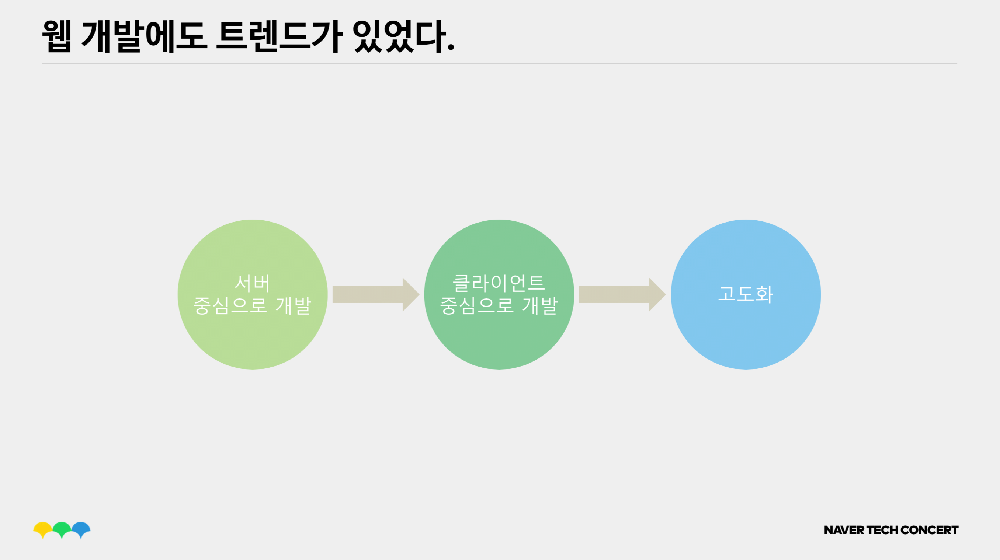
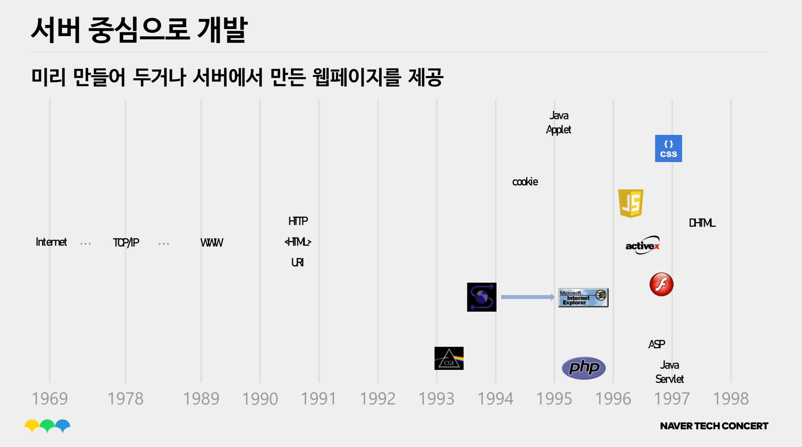
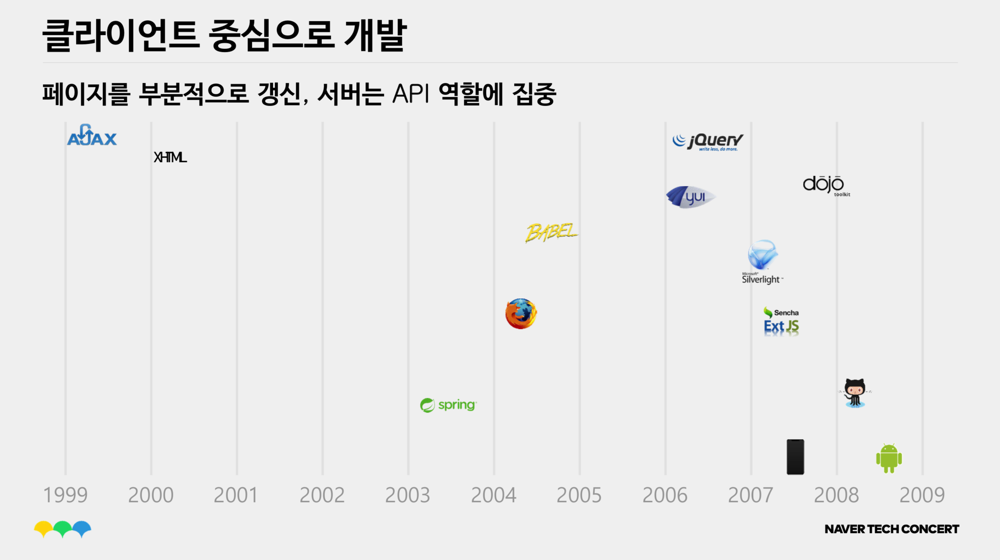
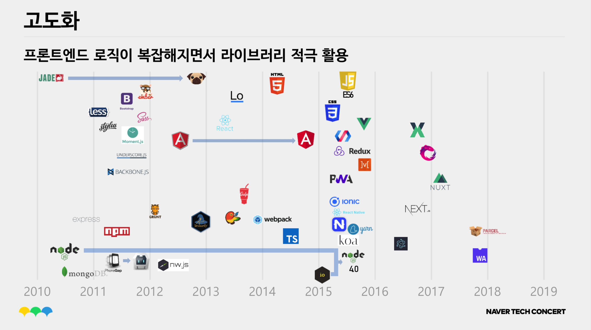

# Vue.js 소개

---

# 본 강의를 시작하기 전에...

---

# 2019년 웹 개발 기술 스택

---

 

이미지 출처 : [kamranahmedse/developer-roadmap: Roadmap to becoming a web developer in 2019](https://github.com/kamranahmedse/developer-roadmap)

---

# 이 중에 Front-End만 살펴 보겠습니다.

---

  

 

이미지 출처 : [Frontend Developer – Roadmaps to becoming a Modern Developer – roadmap.sh](https://roadmap.sh/frontend)

---
<!--backgroundColor : #f2f2f2-->
# NAVER TECH CONCERT - FRONT END
빠르게 훑어보는 웹 개발 트렌드
 

 자료 출처 : [NAVER TECH CONCERT_FE2019_빠르게 훑어보는 웹 개발 트렌드](https://www.slideshare.net/NaverEngineering/naver-tech-concertfe2019) 

---

---

---

사용자가 요청한 화면을  
서버에서 페이지 단위로 생성해서 제공

---

---

일단 클라이언트를 준비하고  
추가로 필요한 데이터를 클라이언트가 주도적으로 요청해서  
이미 화면에 떠있는 페이지 부분에 추가 
DOM에 적극적으로 개입

---

---

복잡해지는 프론트엔드 로직을  
체계적으로 관리하기 위해  
프레임워크, 라이브러리를 적극적으로 사용

---
<!--backgroundImage : linear-gradient(to right,#41b782 ,#86d169)-->
# 그래서 하고싶은 말은?

 

## 모든 프로젝트 모든 시스템에   프론트엔드 프레임워크를 사용해야 하는 것은 아니지만..  

## UI/UX에 대한 사용자들의 눈은 이미 높아질대로 높아졌음 🙁

---

# 👉 높은 수준의 UI/UX를 제공하려면  프론트엔드 프레임워크 선택은 필수  
(<del>높은 수준이 아닐수도 있음... 이미 당연하다고 생각할 수도...</del>)
